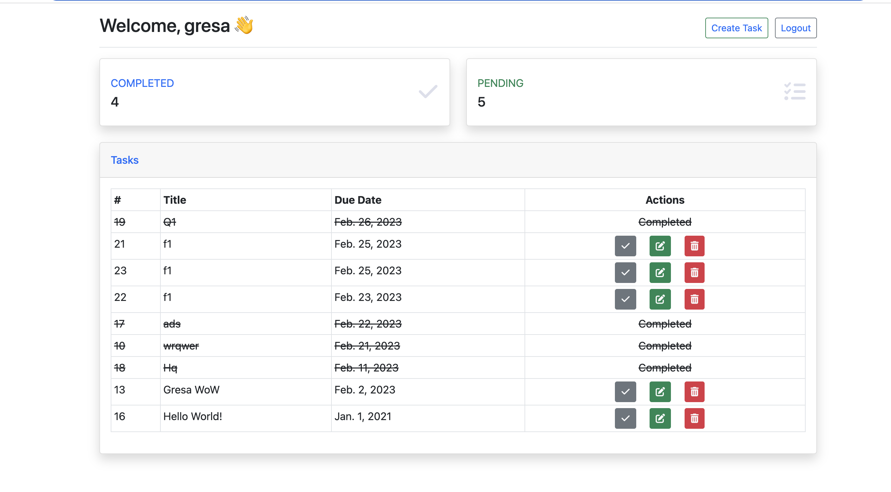
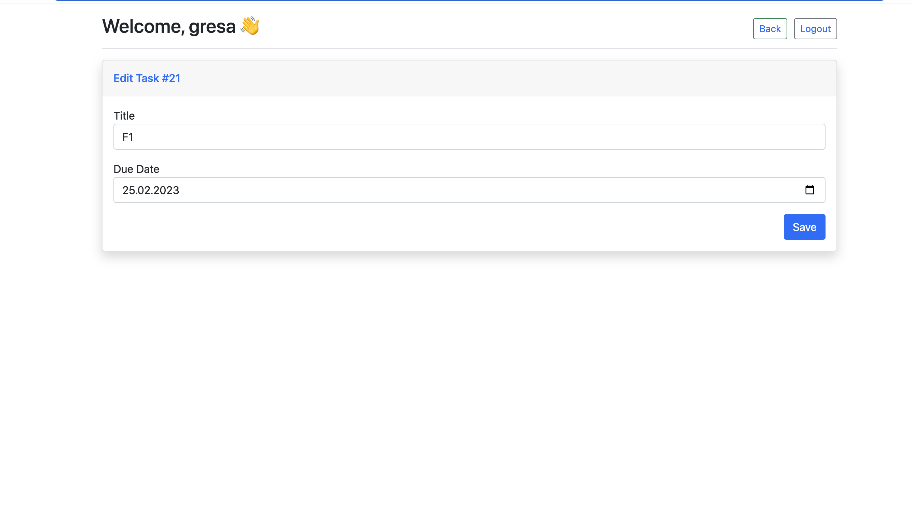
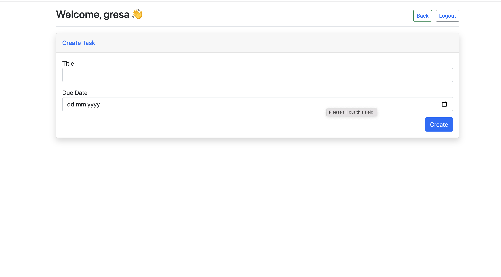
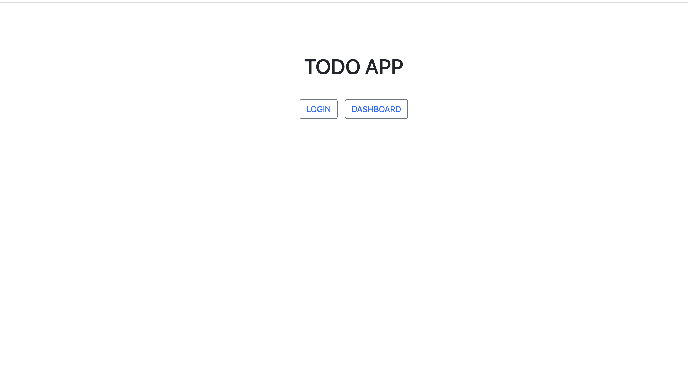
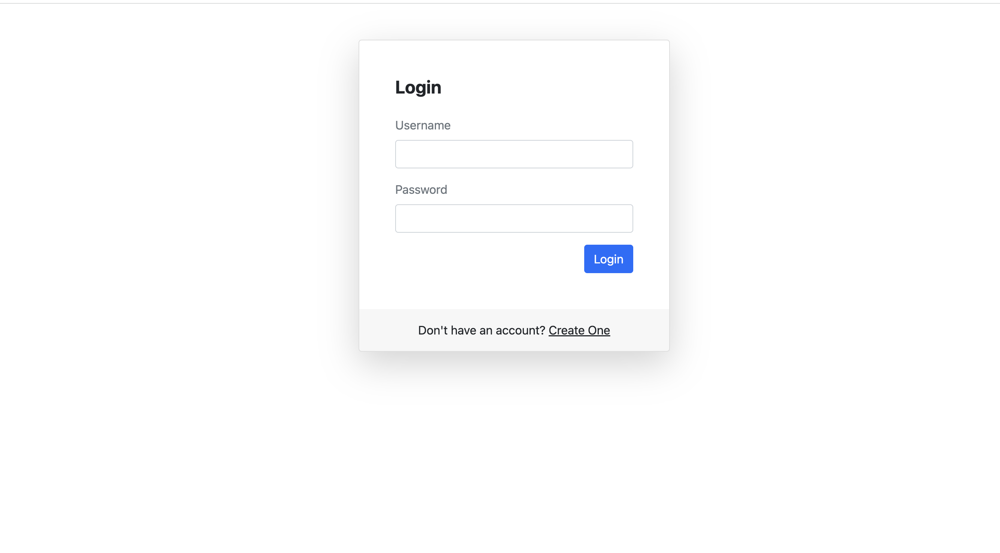
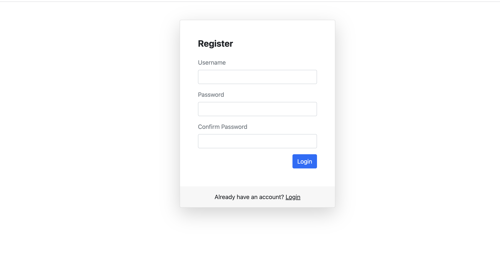

# Introduction
This repository is a simple ap todo app built with Python3 and MySQL. This application allows you to add, edit, delete, and view to-do tasks. The tasks are stored in a MySQL database and can be accessed by multiple users.

# Starting local server:
- python3 manage.py runserver

# Migrations
- python3 manage.py migrate
- python3 manage.py createsuperuser

# Screenshots

